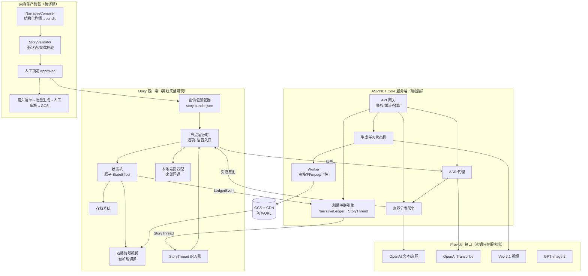

# 《灵脉余烬》AI 真人影视互动游戏 · Codex 开发总纲

日期：2026-07-15
版本：`1.0`
用途：本文件是交给 CODEX GPT（下称 Codex）的**唯一开发入口文档**。Codex 每次会话先读本文件，再按第 9 章任务卡逐个执行。
角色分工：Codex 负责代码、工具、Schema、测试和管线；剧情正文、美术、配音、付费服务开通和发布决策全部由项目负责人（人工）完成。
工作仓库：`Video/`（独立 Git 仓库，远程 `https://github.com/lucifer8900/Video.git`；外层 `VideoGame/` 目录不是工作仓库）。

---

## 0. 快速上手（Codex 首次会话按此顺序执行）

1. 按顺序阅读（只读结论，不重开已定决策）：
   1. 本文件全文。
   2. `docs/superpowers/specs/2026-07-12-ai-video-game-vertical-slice-design.md`（技术路线与验收指标）
   3. `docs/superpowers/specs/2026-07-12-ai-video-game-vertical-slice-implementation-plan.md`（VS 任务编号体系）
   4. `docs/fanren/2026-07-13-fanren-game-world-bible.md`（世界规则，第 5 节"不可变世界规则"最重要）
   5. `docs/fanren/2026-07-13-fanren-combat-progression-system.md`（第 10 节 Unity 数据化）
   6. `docs/fanren/2026-07-14-red-mist-vertical-slice-delivery.md`（当前已交付内容）
2. 环境自检：报告 `dotnet --version`、`git status`、Unity 项目是否存在（`unity/RedMistVerticalSlice/`）。
3. 从第 9 章 `CX-001` 开始，一次只做一张任务卡。开工前列出将修改的文件、依赖和验收命令；先写失败测试，再做最小实现；完成后报告真实测试输出。

---

## 1. 产品定位与四大支柱

一句话定位：**Steam 平台的 AI 真人影视感互动游戏**——所有画面由 AI 生成（不用真人拍摄、不用动捕），玩家用固定选项 + 可选语音推进剧情，选择真实改变关系、任务和世界，自研服务端在受控范围内实时创建剧情关联。

| # | 支柱 | 含义 | 当前状态 | 主要差距 |
|---|---|---|---|---|
| P1 | 影视级画质 | AI 生成真人影视感视频（Veo 3.1，1080p/24fps，4–8 秒镜头剪辑成场景） | 切片内含 6 段概念图运动合成过场，非最终成片 | 角色一致性闸门（G2）未跑；口型方案未定；批量生产管线未建 |
| P2 | 真实玩家互动 | 固定选项兜底 + 可选语音输入；异常语音（辱骂/跑题/沉默）是剧情行为不是报错 | 固定选项 + 4 个小游戏已可玩；语音 0% | VS-040~044 全部未做；200 条中文评测集未建 |
| P3 | 玩家影响剧情 | 关系/任务/世界钟/底牌暴露全部进结算；失败推进世界而非 Game Over | 14 节点、双主角、三类结局已可玩 | 剧情硬编码在 C#（`StoryCatalog.cs`），无法规模化；剧情编译器/校验器未建 |
| P4 | 服务端实时剧情关联 | 自研服务端根据玩家历史实时生成个性化剧情关联（回叫、伏笔、后果、巧遇） | 0%（现有文档只设计了视频生成服务端） | 全新系统，本文件第 5 章给出完整设计 |

---

## 2. 设计分析结论

### 2.1 已经成立的设计决策（不要重开讨论）

1. **先剧情编译、后生成视频。** 顺序：小说文本 → 剧情分析 → 玩家方案矩阵 → NPC 处理方案 → 人工审核锁定 → 视频生成计划 → 批量生成。
2. **固定选项是基础，语音是可选高级入口。** 语音识别失败/断网永远回退到固定选项；语音不是通关必需。
3. **数据先结算、影视后表现。** 战斗和剧情由确定性状态机 + 受控种子结算，视频只负责表现，AI 视频不能决定谁胜谁负。
4. **离线版必须完整可玩。** 在线 AI（语音语义、动态视频、剧情关联）全部是增强层，任何云服务失败不阻塞主线。
5. **运行时模型只能在已审核矩阵内选择或润色，不能改写主干事实**（飞升、宗门覆灭等正史受控）。
6. **技术栈：** Unity（C#）客户端 + ASP.NET Core 服务端 + PostgreSQL + Google Cloud（Cloud Run / Cloud Tasks / GCS）+ Veo 3.1（视频）+ OpenAI（文本/意图/图像/在线转写）+ whisper.cpp（离线 ASR 实验）。所有外部服务经内部 Provider 接口调用，客户端零密钥。
7. **视频不进 Git。** Git 只保存清单、哈希、小样片和生成元数据；成片走对象存储 + CDN + 短期签名 URL。
8. **Steam 增量更新：** 视频按章节/区域/语言/可选 ASR 模型拆 depot，单包控制在 1–2 GB。

### 2.2 现状与差距

已完成（可验证）：

- 设计基线 4 份 + 世界圣经 + 战斗成长系统（含 JSON Schema 草案）。
- 内容资产：110 角色、62 场景、43 具名物品的原创化命名层；16 张角色三视图板、18 张场景板。
- Unity 垂直切片（`unity/RedMistVerticalSlice/`，Unity `2022.3.62f3c1` 中国版 LTS，Windows x64 IL2CPP）：双主角入口、14 节点、4 个小游戏、两阶段墨蛟战、三类结局、存档/行动志/无障碍选项、6 段本地过场。EditMode 测试 3/3 通过。

主要差距（按优先级）：

1. **剧情数据硬编码**：`Assets/Scripts/Story/StoryCatalog.cs` 用 C# 写死 14 个节点。这是规模化的第一瓶颈——剧情编译器、校验器、服务端关联注入全部依赖数据外置。→ 里程碑 M1。
2. **语音管线缺失**：P2 的差异化卖点完全未实现。→ M2。
3. **服务端不存在**：`server/` 目录还没有创建；生成管线（排队/审核/转码/分发/成本控制）只有设计。→ M3。
4. **实时剧情关联无设计**：P4 是新需求，与"正史受控"原则存在张力，必须用叙事权限分层解决（第 3 章）。→ M4。
5. **视频量产未启动**：切片过场是概念图合成；G2 一致性闸门（同一角色 10 段视频 ≥8 段达 4/5 一致性）未验证，通过前禁止批量生成。→ M5。

### 2.3 风险与对策

| 风险 | 影响 | 对策 |
|---|---|---|
| AI 视频角色一致性不达标 | P1 不成立，全项目卡死 | G2 闸门先行（VS-011）；不达标就停在闸门调整方案，不许用加大生成量掩盖 |
| 实时生成剧情破坏正史 | 剧情崩坏、玩家存档不一致 | 叙事权限分层（第 3 章）：运行时只能写 L3 短效层和 L2 参数槽，一致性守卫强制校验，违规回退默认线程 |
| 生成成本失控 | 预算爆炸 | 每任务成本上限 + 账号/章节/每日硬上限 + 幂等键防重复扣费；关联引擎默认只复用已有媒体（`reuse_only`），不做实时视频关联 |
| 语音误判触发严重后果 | 玩家被冤枉、体验崩坏 | 严重后果需高置信度或 NPC 二次确认；200 条评测集回归；误伤率 <1% |
| 版权 | 无法商业发行 | 内容改编自内部研究源；`source-to-game-name-map.json` 标记 `internalOnly/doNotShip`；公开发行前必须人工完成授权或深度原创化。**Codex 不得虚构新剧情正文，不得把映射文件带入任何构建产物** |
| Unity 版本分歧 | 设计文档写 Unity 6，实际切片是 2022.3 LTS | 决策：**维持 2022.3.62f3c1**（可工作的基线），Unity 6 迁移列为开放问题，等 M3 结束后由人工决定 |

### 2.4 需要人工决策的开放问题（Codex 遇到时停下询问，不要自行决定）

- 版权路线：授权改编 vs 继续深度原创化。
- 云账号开通与预算释放（GCP / OpenAI 的正式项目和支出上限）。
- Unity 6 迁移时机。
- 首个在线运营章节的内容范围。
- 任何新剧情文本、台词、角色/场景视觉的采用。

---

## 3. 叙事权限分层（本项目最重要的新增架构决策）

P4"实时创建剧情关联"与既有原则"正史受控"的矛盾，用四层权限解决。**任何写剧情状态的代码都必须声明自己操作哪一层，越层写入是 Bug。**

| 层 | 名称 | 内容 | 谁能写 | 生命周期 |
|---|---|---|---|---|
| L0 | 不可变事实 `StoryFact` | 正史结果、世界规则、关键人物生死 | 只有人工锁定流程（编译期） | 永久，运行时只读 |
| L1 | 已审核剧情包 | 场景节点、选项、方案矩阵、台词、媒体引用（`story.bundle.json`） | 剧情编译器 + 人工 `approved` 后编译 | 随版本发布 |
| L2 | 关联模板实例 `StoryThread` | 服务端从已审核 `AssociationTemplate` 实例化的个性化剧情线程（参数槽填充 + 受控文本变体） | 服务端关联引擎（运行时），经 Schema 校验 + 一致性守卫 | 章节内有效，过期作废 |
| L3 | 短效风味层 | NPC 顺口提及、氛围文本等一次性内容 | 运行时 LLM 在白名单槽位内生成 | 单节点，**永不落库成事实** |

规则：

1. L2/L3 引用的实体（人名、地点、物品）必须存在于 L0/L1 注册表，禁止发明新专名。
2. L2 效果只允许操作白名单 `StateEffect`（关系微调、线索标记、支线解锁），禁止杀死具名角色、发放正史唯一物、改任务主干。
3. 每次 L2/L3 生成都记录审计（提示词版本、模型快照、输入哈希、校验结果），复用 `GenerationJob` 表。
4. 离线模式：L2 槽位使用剧情包内预置的默认线程，L3 槽位使用预置文本池。体验降级但完整。

---

## 4. 目标架构



模块职责与既有 VS 任务映射：

| 模块 | 位置 | 对应 VS 任务 |
|---|---|---|
| 剧情包 Schema + 编译器 + 校验器 | `tools/NarrativeCompiler`、`tools/StoryValidator` | VS-020~024 |
| Unity 剧情包加载/节点运行时/存档 | `unity/RedMistVerticalSlice`（已有代码重构） | VS-031~033（部分已实现，待数据外置） |
| 语音输入 + ASR + 意图分类 | Unity + `server/Api` | VS-040~044 |
| 服务端基线 + 生成管线 | `server/Api`、`server/Worker` | VS-050~055 |
| 剧情关联引擎 | `server/Api`（`AssociationService`） | 新增（本文件第 5 章） |
| 视频量产工具 | `tools/MediaPipeline` | VS-060~064 |
| Steam 拆包与测试 | 构建脚本 | VS-070~074 |

---

## 5. 实时剧情关联引擎（Story Orchestrator）详细设计

### 5.1 目标

让两个做过不同选择的玩家，在同一章节感受到**不同的剧情回响**：欠过的人情被讨还、放走的敌人再次出现、暴露过的底牌被针对、错过的支线以传闻形式回来。这些关联由服务端实时决定和参数化，但骨架全部来自人工审核的模板。

### 5.2 数据对象

**NarrativeLedger（叙事账本）**——服务端按玩家累积的结构化事件流：

```json
{
  "entryId": "led.0193f2",
  "playerId": "p.8842",
  "type": "debt_incurred",
  "actors": ["char.shen_yan", "npc.shi_jun"],
  "severity": 3,
  "chapter": "red_mist",
  "worldClock": 1440,
  "sourceNodeId": "node.shijun_negotiation",
  "factRefs": ["fact.shijun_alive"],
  "payload": { "debtKind": "spared_life" }
}
```

`type` 枚举（首批）：`debt_incurred`、`debt_repaid`、`secret_exposed`、`promise_made`、`promise_broken`、`npc_rescued`、`npc_abandoned`、`enemy_spared`、`item_gained`、`quest_expired`、`trump_card_revealed`。

**AssociationTemplate（关联模板，L2 骨架，人工审核内容）**：

```json
{
  "templateId": "assoc.spared_enemy_returns.v1",
  "kind": "consequence",
  "authorityLevel": "L2",
  "preconditions": {
    "requiresLedger": [
      { "type": "enemy_spared", "minSeverity": 2, "maxAgeWorldClock": 20160 }
    ],
    "forbidsFacts": ["fact.{target}_dead"],
    "chapterWindow": ["red_mist", "qifeng_valley"]
  },
  "parameterSlots": {
    "target": { "source": "ledger.actors[1]" },
    "place": { "source": "route.upcomingNode.location" }
  },
  "injectionPoints": ["travel_event", "npc_mention"],
  "textPolicy": "llm_variant_within_style_guide",
  "allowedEffects": [
    { "op": "relationship", "field": "suspicion", "range": [-5, 10] },
    { "op": "clue", "value": "clue.{target}_watching" }
  ],
  "mediaPolicy": "reuse_only",
  "fallbackThreadId": "assoc.default.enemy_rumor",
  "cooldownWorldClock": 10080,
  "maxTriggersPerPlayer": 1
}
```

`kind` 枚举：`callback`（回叫）、`foreshadow`（伏笔）、`consequence`（后果）、`encounter`（巧遇）。
`mediaPolicy` 枚举：`reuse_only`（只复用已有镜头/环境循环，默认）、`allow_runtime_generation`（仅限章节结尾关键节点，走 VS-051 生成管线）。

**StoryThread（签发给客户端的线程实例）**：

```json
{
  "threadId": "thr.7a01",
  "templateId": "assoc.spared_enemy_returns.v1",
  "playerId": "p.8842",
  "resolvedParams": { "target": "npc.shi_jun", "place": "loc.mist_gate" },
  "injections": [
    {
      "nodeId": "node.mist_gate_arrival",
      "point": "npc_mention",
      "text": "……（经校验的生成文本）",
      "effects": [{ "op": "clue", "value": "clue.shi_jun_watching" }]
    }
  ],
  "mediaRefs": ["cue.ambient_mist_loop"],
  "expiresAtChapterEnd": true,
  "auditRef": "genjob.55d2",
  "fallbackUsed": false
}
```

### 5.3 运行流程

```text
客户端节点结算 → 上报 LedgerEvent（在线时；离线积压，重连补传）
→ 服务端累积 NarrativeLedger
→ 客户端在"章节边界前一个节点"异步预取 GET /association/next
→ 服务端：
   1. 规则过滤：遍历模板库，用 preconditions 做确定性筛选（纯代码，不用 LLM）
   2. 排序与参数化：LLM 对候选打分排序、填充参数槽、生成文本变体（严格 JSON 输出）
   3. Schema 校验：违规直接丢弃该候选
   4. 一致性守卫（见 5.4）
   5. 签发 StoryThread（含 fallbackThreadId），写审计
→ 客户端把 injections 织入对应节点的注入槽位
→ 超时（硬上限 8 秒）/离线/校验失败 → 使用剧情包内默认线程
```

### 5.4 一致性守卫（先确定性，后模型）

1. **确定性检查（必过）**：所有实体 ID 存在于注册表；`forbidsFacts` 无冲突；目标 NPC 当前存活且位置可达；效果全部在 `allowedEffects` 白名单和数值范围内；冷却与次数上限未超。
2. **模型复核（可选开关）**：低成本文本模型判断生成文本是否与 L0 事实、角色性格、当前章节语气冲突，输出 `pass/reject + reason`。
3. 任一步失败 → 换下一候选或回退默认线程。**守卫拒绝不是错误，是正常路径**，必须有指标统计。

### 5.5 成本与延迟预算

- 每玩家每章节边界最多 2 次 LLM 调用（排序参数化 1 + 可选复核 1），用低成本文本模型。
- P95 端到端 < 5 秒（异步预取期间完成），硬超时 8 秒回退。
- 默认 `reuse_only`：关联线程不触发视频生成；`allow_runtime_generation` 模板每章节全局限 1 个，且走既有预算硬上限体系（VS-055）。

### 5.6 隐私

Ledger 只含游戏行为事件，不含语音原文、录音或任何设备信息。玩家删档时级联删除。

---

## 6. 数据契约总表

编译期（`tools/` 输出，进 Git）：

| 契约 | 说明 | Schema 位置（目标） |
|---|---|---|
| `StoryFact` | L0 不可变事实 | `server/Contracts/schemas/story-fact.schema.json` |
| `CharacterDefinition` / `CharacterState` | 身份视觉规则 / 运行时状态 | 同上目录 |
| `QuestDefinition` | 状态、时限、完成/失败/过期后果 | 同上 |
| `SceneNode` | 进入条件、媒体、选项、语音能力、注入槽位 | 同上 |
| `VoiceIntent` / `NpcResponse` | 意图集合 / 确定台词+口型视频+状态影响 | 同上 |
| `CombatantState` / `EncounterDefinition` / `CombatResolution` | 战斗数据化（combat 文档第 10 章已有草案） | 同上 |
| `MediaAsset` / `GenerationJob` | 媒体清单 / 生成审计 | 同上 |
| `SaveGame` | 剧情包版本、节点、状态快照、迁移版本 | 同上 |
| `story.bundle.json` | 以上编译产物 + 内容哈希 | 编译器输出，不手写 |

运行期新增（本文件定义）：

| 契约 | 说明 |
|---|---|
| `LedgerEvent` / `NarrativeLedger` | 5.2 节 |
| `AssociationTemplate` | 5.2 节，人工审核内容，进 Git |
| `StoryThread` | 5.2 节，服务端签发，不进 Git |

所有 Schema 用 JSON Schema draft 2020-12，版本化（`schemaVersion` 字段），单独测试夹具目录 `tests/StoryFixtures/`。`SceneNode` 相比原设计新增字段：`injectionPoints: ["node_intro","travel_event","npc_mention"]`（可为空数组，表示该节点不接受关联注入）。

---

## 7. 仓库结构（现状 → 目标）

```text
Video/                          # 工作仓库
  docs/                         # 设计文档（已有）
  content/                      # 角色/场景/系统数据（已有）
    originalization/            # 命名映射（internalOnly，禁止进构建产物）
    story/                      # [新增] 结构化剧情源（人工可读 JSON/YAML）
    templates/associations/     # [新增] AssociationTemplate 库
  unity/RedMistVerticalSlice/   # Unity 客户端（已有，2022.3.62f3c1）
  server/                       # [新增]
    Api/                        # ASP.NET Core Web API（.NET 8 LTS）
    Worker/                     # 生成/审核/转码任务
    Contracts/                  # 共享数据契约 + JSON Schema（类库，Unity 侧用源码链接或生成副本）
  tools/                        # 已有 gemini/、migration/，新增：
    NarrativeCompiler/          # 结构化剧情 → story.bundle.json
    StoryValidator/             # 图/状态/媒体校验 CLI
    MediaPipeline/              # 镜头清单、FFmpeg、哈希、上传
  tests/
    StoryFixtures/              # Schema 正反例夹具
    VoiceFixtures/              # 200 条语音评测集
    MediaFixtures/
```

工程约定：

- 服务端与工具统一 .NET 8 LTS，单个解决方案 `Video.sln`。
- 单元测试用 xUnit；数据库集成测试标记 `[Trait("Category","Integration")]`，默认 CI 跳过，本地用 Docker PostgreSQL 跑。
- Unity 侧不引用 NuGet 包；`Contracts` 中需要进 Unity 的模型用无依赖 POCO 写，通过复制/链接进 `Assets/Scripts/Contracts/`。
- 代码标识符英文，注释与文档中文（跟随现有代码风格）。

---

## 8. 工程规范与红线（Codex 每个任务必须遵守）

1. **一次一张任务卡。** 开工先列：将修改的文件、依赖、验收命令。先写失败测试，再最小实现，完成后贴真实测试输出，不跳过失败项。
2. **任何 AI 输出都是结构化数据**，必须过 JSON Schema + 业务校验；LLM 返回不合法 JSON 按失败处理并重试/回退。
3. **外部服务只经 Provider 接口**；每个 Provider 必须有 Mock 实现，单测只用 Mock；真实调用只在集成环境且有预算上限。
4. **客户端零密钥**；API 不转发大视频字节；日志不得输出密钥、签名 URL、原始录音。
5. **不提交**：大视频、密钥、签名 URL、玩家录音、临时生成目录、`Builds/`、`Library/`。
6. **`content/originalization/source-to-game-name-map.json` 绝不进入**：客户端构建、剧情包、任何公开产物。构建脚本用白名单复制。
7. **不虚构剧情内容。** 需要新台词、新角色、新模板文案时，生成占位符并标记 `needs_review`，停下请求人工提供或审核。
8. **不引入计划外框架**（不加 Redis、不上 K8s、不换 ORM、不自研 ECS）。确有必要先在任务报告中说明理由并等待人工同意。
9. **明确不做**（继承设计文档第 9 节）：自由镜头 3D 开放世界、无限 NPC 自由聊天、运行时创建完整新主线、多人联机、本地高质量视频生成、4K 资源包、完整支付系统。
10. **确定性可复现**：受控随机一律 `storySeed + encounterId + attemptIndex`；读档不能洗结果。
11. 每个在线功能都有离线回退路径，且回退路径有测试。

---

## 9. 里程碑与任务卡

依赖关系：`M1 → M2 → M3 → M4 → M5`（M2 与 M3 可部分并行；M4 依赖 M1 的数据外置和 M3 的服务端基线）。

### M0 工程基线

**CX-001 解决方案骨架与 CI**
- 内容：创建 `Video.sln`、`server/Api`、`server/Worker`、`server/Contracts`、`tools/NarrativeCompiler`、`tools/StoryValidator` 空项目 + xUnit 测试项目；GitHub Actions 跑 `dotnet build && dotnet test`。
- 验收：`dotnet test` 全绿；CI 在 push 时运行；无业务逻辑。

### M1 剧情数据外置化（对应 VS-020~024、VS-031 重构）

**CX-101 定义全套 JSON Schema**
- 内容：第 6 章列出的编译期契约全部落成 schema 文件 + 正反例夹具。`SceneNode` 含 `injectionPoints`。
- 验收：正例通过；缺 ID、悬空引用、严重后果无确认规则等反例失败且报出 JSON 路径。

**CX-102 StoryValidator CLI**
- 内容：检查重复 ID、悬空引用、不可达节点、无出口节点、无离线回退、任务状态不完整、媒体缺失、循环无终止。
- 验收：`dotnet run --project tools/StoryValidator -- content/story/red-mist/` 对错误夹具逐一产生预期诊断；失败退出码非零。

**CX-103 NarrativeCompiler：红雾章节数据化**
- 内容：把 `unity/.../Story/StoryCatalog.cs` 与 `CinematicCatalog.cs` 中硬编码的 14 节点**忠实转写**为 `content/story/red-mist/` 结构化 JSON（不改剧情文本），编译输出 `story.bundle.json`（含内容哈希）。
- 验收：校验器全绿；bundle 中节点数、选项数、结局可达性与现有 C# 目录一致（写对照测试）。

**CX-104 Unity 剧情包加载器替换硬编码**
- 内容：从 `StreamingAssets` 加载 bundle（版本/Schema/哈希校验，损坏包给友好错误页）；`StoryCatalog` 改为 bundle 驱动；保留旧类做一版兼容对照。
- 验收：现有 EditMode 测试 3/3 保持通过；新增等价性测试：遍历全部固定选项路径，可达结局集合与硬编码版一致；`SaveEnvelope` 记录 bundle 版本 + 哈希，不匹配时明确拒绝加载并提示。

### M2 语音互动（对应 VS-040~044）

**CX-201 麦克风输入与按住说话**
- 验收：无麦克风、权限拒绝、设备断开、超时都回退固定选项，不崩溃。

**CX-202 ASR Provider 与服务端代理**
- 内容：`IAsrProvider`（Mock + OpenAI Transcribe 实现）；客户端只传短音频到自家 API。
- 验收：大小/时长/频率限制生效；Mock 下契约测试全绿；音频按配置删除。

**CX-203 场景限定意图分类**
- 内容：`IIntentClassifier`（Mock + OpenAI 实现 + 本地关键词回退）；只能输出当前节点 `voiceIntents` 集合内的意图或 `irrelevant/low_confidence`，严格 JSON。
- 验收：未知表达不能创建新意图或新状态字段；低置信度必进追问或回退。

**CX-204 异常输入剧情化**
- 内容：辱骂/跑题/过长/沉默/低置信度 → 节点配置的 NPC 剧情反应（`invalid_input_rules`）。
- 验收：严重后果（攻击、永久决裂、任务失败）需高置信度或二次确认，测试覆盖。

**CX-205 语音评测集与回归工具**
- 内容：`tests/VoiceFixtures/` 200 条中文样本（文本先行，录音由人工补充）+ 评测 CLI 输出准确率/误伤率报告。
- 验收：报告含每类样本的期望意图、实际意图、置信度；指标线：有效意图准确率 ≥90%，严重误伤 <1%。

### M3 服务端与生成管线（对应 VS-050~055）

**CX-301 API 基线**：健康检查、结构化日志、请求 ID、限流、配置校验、统一错误格式。缺关键配置启动即失败。
**CX-302 生成任务状态机 + PostgreSQL**：`created→queued→generating→moderating→transcoding→ready|failed|expired`，数据库约束保证转移合法；幂等键；Worker 重启可续。
**CX-303 Veo / 图像 / 文本 Provider**：接口 + Mock 全量测试；真实实现只读服务端配置的模型 ID。
**CX-304 FFmpeg 转码与分发**：标准化、响度、时长、哈希、GCS 上传、签名 URL；API 不回传视频字节。
**CX-305 成本控制**：账号/设备/章节/每日/全项目预算表；超限直接返回备用视频状态，不调供应商。
**CX-306 客户端生成闭环**：排队→轮询→下载缓存→播放；成功/超时/审核失败/重复请求/断网五路径测试，失败必播备用视频。

### M4 实时剧情关联引擎（新增）

**CX-401 LedgerEvent 上报与存储**
- 内容：`Contracts` 定义 `LedgerEvent`；Unity 在节点结算后入队上报（离线积压重传）；服务端落库。
- 验收：断网积压 → 重连补传不重复（幂等键 = playerId+entryId）；Ledger 查询按玩家+章节过滤。

**CX-402 AssociationTemplate Schema 与加载**
- 内容：schema + `content/templates/associations/` 加载器 + 校验（引用实体必须存在于注册表）。首批模板文件由人工提供，Codex 只放 2 个占位模板（标记 `needs_review`）供测试。
- 验收：非法模板（未知实体、越权效果、缺回退）被拒并报路径。

**CX-403 关联决策服务**
- 内容：规则过滤（纯代码）→ LLM 排序/参数化/文本变体（`IAssociationRanker` Provider，Mock 先行）→ Schema 校验 → 签发 `StoryThread`。
- 验收：Mock 下全流程确定性可测；LLM 输出非法 JSON → 自动换候选/回退；P95 延迟测试（Mock 模拟慢响应触发 8 秒回退）。

**CX-404 一致性守卫**
- 内容：5.4 节确定性检查全部实现 + 可选模型复核开关。
- 验收：构造违规夹具（引用死亡 NPC、越权效果、超冷却、发明新专名）拦截率 100%；拦截计数进指标。

**CX-405 客户端 StoryThread 织入**
- 内容：预取、注入槽位渲染（`node_intro/travel_event/npc_mention`）、效果应用、章节结束作废。
- 验收：等价性保证——无线程时节点行为与 M1 基线完全一致；有线程时效果全部走既有 `StateEffect` 原子通道；离线用默认线程。

**CX-406 审计与指标**
- 验收：每个线程可追溯 模板+参数+提示词版本+模型快照+守卫结果；指标含：候选数、拒绝原因分布、回退率、延迟分位。

### M5 视频量产与 Steam（对应 VS-060~064、VS-070~074）

- **CX-501 镜头清单生成器**：从 bundle 反查每节点媒体需求，输出 `shot-manifest.json`（镜头 ID、台词、首尾帧引用、生成档位、成本上限、备用资源）。
- **CX-502 批量生成驱动**：按清单提交 ≤20 个/批，Fast 档预览、采用后升级档位；记录采用率与单位成本。**G2 一致性闸门未人工确认通过前，此任务禁止对接真实供应商。**
- **CX-503 口型审核工具**：逐条播放 + 人工标记通过/重做，导出审核报告。
- **CX-504 Addressables 拆包与增量更新实验**：基础包/章节视频/中文音频字幕/可选 ASR 模型分包；A/B 构建对比补丁大小。
- **CX-505 全路径自动测试**：枚举固定选项 + 主要语音意图 + 有/无关联线程，跑状态机到全部结局；无死路、无缺失媒体、无未处理异常。
- **CX-506 开放授权真实参考库与 GPT Image 2 视觉基线**：在 `content/reference-library/` 建立本机参考图库、分类目录、JSON Schema、来源/作者/许可证/SHA-256 清单与可重复下载校验工具；参考原图只保留在被 Git 忽略且不进入 Unity 构建的本机目录。首批覆盖风景、建筑、植物、动物、水域、气候、天象、人物姿态与表情、服饰织物、器物、地质洞窟、光影雾火至少 12 类，每类不少于 4 张。仅采用允许商业修改的 CC0、Public Domain Mark 或 CC BY 素材，拒绝 NC、ND、SA、来源不明图片、影视截图、社交媒体图片和演员/公众人物身份复刻；人物照片只作动作、重心和微表情参考并显式记录 `identityReuse=false`。基于已审核的原创世界规则，使用 Codex 内置 GPT Image 2 先生成建筑环境、山水气象、原创人物、原创灵兽各 1 张非覆盖试制图，逐张记录所用参考资产 ID、完整提示词与 `needs_review`，不得自动替换现有首帧或进入发布构建。
  - 验收：先以失败测试证明缺来源页、许可不允许商业修改、哈希不符、分类不足、身份复刻标记或原图进入 Git/构建均被拒；随后本机下载总数不少于 48，全部文件哈希与严格 Schema 清单一致且可追溯到原始许可页；4 张试制图均保存到项目、无文字/水印、引用清单内参考图并保持人工未采用状态；完整 `.NET` 测试保持全绿。任何一张图被游戏采用前，必须由人工完成视觉、相似人物与版权复核。
- **CX-507 中国地域、历代建筑与自然现象参考库扩充**：继承 CX-506 的 reference-only/do-not-ship 边界，将审核采用的参考素材扩充到不少于 800 项。结构化覆盖中国 34 个省级地区（每地不少于 8 项，兼顾古迹建筑和自然景观）、主要古都与宫苑、先秦至清代建筑形制、皇家/江南/岭南/寺观/山地/水景园林、代表性地貌，以及风、雨、雷、电、雪、雾、云海、冰雹、沙尘、台风等自然现象。清单增加地域、地点、年代/朝代、建筑类型、真实性状态（原存/修复/重建/遗址）、季节、时段、天气、地貌与检索用途标签；同一素材可以满足多个覆盖维度，但不得重复计入同一维度配额。采集候选缓存与审核采用原图隔离，只有通过地域相关性、签名/哈希、重复检测和人工复核的文件才能进入 catalog；默认仍优先 CC0、Public Domain Mark、CC BY，用户已明确允许个人参考用途使用 `unverified` 来源和降低分辨率的短缺例外，所有此类素材保持 `needs_review`、不进 Unity 构建且不宣称可商用。
  - 验收：先以失败测试证明省级地区不足、建筑/自然比例不足、年代/真实性标签缺失、天气或古都配额不足、同图/同来源重复灌水、SA/NC/ND 或候选缓存混入 catalog 均会被拒；随后本机清单与严格 Schema 一致且审核采用项不少于 800，34 个省级地区各不少于 8 项，其余历史建筑、园林、地貌和自然现象配额全部在覆盖报告中逐项通过；所有本机采用文件签名、长度与 SHA-256 一致，原图和候选缓存均被 Git 忽略且不进入 Unity 构建；抽样联络表供人工视觉复核，完整 `.NET` 测试保持全绿。著名地点在严格许可下无可用来源时必须报告缺口，不得使用许可不合格图片补数。
- **CX-508 赤雾视觉圣经与参考驱动首帧候选重建**：在 CX-507 的 `referenceOnly/do-not-ship` 图库基础上，为《赤雾秘苑》建立严格 Schema 校验、可追溯且尚未采用的视觉圣经。锁定既有世界规则、剧情事实与用户已经明确的真人影视方向，不新增剧情、台词、具名人物或世界规则；以参考图分别承担建筑结构、材质、天气光线、人物姿态/微表情和服饰工艺角色，真人参考一律 `identityReuse=false`，不得复刻演员、公众人物或参考照片身份。使用 Codex 内置 GPT Image 2 / `imagegen` 生成沈砚、楚明绮、石峻、青衣侦察者、蛟窟盟友、阵灵和墨蛟共 7 张版本化身份锚点，再基于身份锚点与场景参考为 CX-505 的 15 张首帧逐一生成新的 16:9 候选；所有输出放在 `content/visual-candidates/cx508/`，保持 `needs_review`、`adopted=false`、`shipInBuild=false`，不得覆盖 `*_grand_v2.png`，不得进入 Unity `Resources`、`StreamingAssets`、Addressables 或任何构建。提示词必须逐图记录完整文本、输入图角色、参考资产 ID、输出 SHA-256、尺寸、复用视频集合和禁止项；对象数量、手持物、环形法宝、阵钉、箱匣及墨蛟解剖等连续性约束必须显式锁定。生成后制作联络表并按真实皮肤/布料、脚部承重、接触阴影、共享环境光、透视尺度、手部/道具稳定、无文字水印、非真实地标复刻和非演员相似九类检查记录人工待审状态。不得调用 Gemini、Veo 或任何视频生成服务。
  - 验收：先以失败测试证明未知/错误哈希参考、真人身份复用、缺少参考图角色、未验证素材被标为可商用、候选被标记 adopted/可发货、输出落入 Unity 运行时目录、缺少任一 15 张首帧映射、非版本化文件名、非 16:9 尺寸、非 PNG 签名、非等比后处理或提示词缺少人物/道具连续性禁止项均会被拒；随后视觉圣经和全部产物通过 Draft 2020-12 Schema、业务校验、文件签名/长度/SHA-256 与引用反查。7 张身份锚点和 15 张首帧候选全部存在，首帧与 CX-505 的 15 项复用表一一对应且不改原文件；任何裁切只允许居中或声明焦点的等比裁切，禁止非等比拉伸。所有图片仍为 `needs_review` 且不进入 Unity 构建；联络表与逐图审核清单齐备，是否采用由人工另行决定。ReferenceLibrary 专项测试、Schema 测试及 `Video.sln` 全量测试保持全绿；报告真实输出并确认本卡未调用 Gemini/Veo。

- **CX-509 五项身份锚点服饰与墨蛟形态返工**：根据人工对 CX-508 的退回意见，只重做楚明绮、青衣侦察者、阵灵、石峻和墨蛟五个版本化身份锚点，不改剧情、台词、具名人物、15 张首帧或 Unity 运行时资源。保留沈砚、蛟窟盟友、建筑与风景的宏伟方向；正反派场景均保持开阔、堂皇和有真实材质的建筑空间，反派感通过神态、姿势、阵法和局部冷暖光表达。网络图片只作服饰构造、姿态、灯光和传统龙形态研究，真人参考固定 `identityReuse=false`；清朝服饰、演员脸和现实地标不得复刻。墨蛟必须是中国蛟龙而非黑色蜥蜴：龙首、长须、鬃毛、鳞身、四爪、蛇形长身、无翼；石峻必须使用正常七头半人体和短粗方截面阵钉，楚明绮月环固定在腰部且双手空，阵灵使用有真实重量的魏晋/宋制礼仪道袍。使用 Codex 内置 ImageGen 生成 5 张横向 16:9 候选，裁切为 1664×936，输出到 `content/visual-candidates/cx509/`，保持 `needs_review`、`adopted=false`、`shipInBuild=false`，私人网络研究图留在 Git 忽略目录，不进 Unity。
  - 验收：先以失败测试证明 CX-509 清单缺失或未实现命令时红灯；随后新增 Draft 2020-12 Schema、CLI 业务校验和 5 张候选。校验必须拒绝错误版本/顺序、缺少建筑/材质/灯光/姿态/服饰或生物解剖参考、研究图身份复用、候选采用/可发货、Unity 路径、非 PNG、非 1664×936 16:9、非等比裁切、缺少宏伟环境或墨蛟反蜥蜴约束。5 张候选、完整规范化提示词、来源页、参考角色、文件长度/SHA-256、后处理和九项人工审核状态齐备；不得覆盖 CX-508 或进入 Unity。专项测试、Schema 测试及 `Video.sln` 全量测试保持全绿；确认本卡未调用 Gemini/Veo，是否采用仍由人工审核决定。

- **CX-510 青衣侦察者比例定点修正**：根据人工对 CX-509 的唯一退回意见，只修正 `identity.celadon_scout.v2` 的头身比例，生成版本化 `identity.celadon_scout.v3`；楚明绮、阵灵、石峻、墨蛟以及 v2 文件全部保持不变。以 v2 作为衣着、配色、宏伟仙门、云海和光线连续性参考，以 CX-507/CX-509 服饰研究图只作工艺参考且固定 `identityReuse=false`。提示词必须锁定约 `7.5 heads` 的自然人体、标准 `50mm` 等效镜头、`no wide-angle distortion`、头部不得放大、双手空置、完整双脚和地面接触阴影；不新增剧情、台词、具名人物、道具或现代/清朝服饰。使用 Codex 内置 ImageGen 生成新的横向 16:9 PNG，等比中心裁切为 1664×936，保存到 `content/visual-candidates/cx510/`，保持 `needs_review`、`adopted=false`、`shipInBuild=false`，不得覆盖 v2 或进入 Unity。
  - 验收：先以失败测试证明 CX-510 清单/命令缺失时红灯；随后新增 Draft 2020-12 Schema、CLI 业务/文件签名校验和比例修正候选。校验必须拒绝采用/可发货、覆盖 v2、Unity 运行时路径、非 PNG、非 1664×936、非等比裁切、错误参考角色/哈希、研究图身份复用，以及缺少 `7.5 heads`、`50mm`、`no wide-angle distortion`、宏伟环境和头身比例连续性锁。v3、完整提示词、参考图角色、文件长度/SHA-256、后处理和人工审核状态齐备；联络表同时展示 v2/v3 供人工比较。专项测试、Schema 测试及 `Video.sln` 全量测试保持全绿；确认本卡未调用 Gemini/Veo，是否采用仍由人工审核决定。

- **CX-511 青衣侦察者 v3 采用与 Unity 注册**：根据用户明确的“采用 v3”决定，将 CX-510 的 `identity.celadon_scout.v3` 以新文件复制到 Unity `Assets/Resources/Generated/Characters/`，注册 `GeneratedArtCatalog.CeladonScoutIdentity` 并纳入 `VerticalSliceBuilder` 的资源完整性检查。保留 CX-510 review-only 清单、v2 文件和其它身份锚点；不改剧情、台词、视频首帧或既有文件，不新增视频生成调用。采用清单固定 `adopted=true`、`shipInBuild=true`、`overwriteExistingAssets=false`，记录用户审核、源/目标 SHA-256、1664×936 PNG、Unity `.meta` GUID 和 Resources 加载键。
  - 验收：先以失败测试证明 CX-511 清单/命令缺失时红灯；随后新增 Draft 2020-12 Schema、CLI 业务/文件校验、Unity 资源与 `.meta`、目录注册和采用记录。校验必须拒绝源哈希漂移、目标不在 `Resources/Generated/Characters/`、覆盖旧资源、缺 `.meta`/GUID、源目标字节不一致、历史 CX-510 清单被改写、未明确人工批准或 Gemini/Veo 标记；目标 PNG 必须是 1664×936 16:9。专项测试、Schema 测试、Unity 内容门禁、`Video.sln` 全量测试和 Release 构建保持全绿；后续把 v3 传播到视频首帧或剧情节点仍须另开任务卡。

- **CX-512 青衣侦察者 v3 对话首帧传播候选**：只为 CX-505 的三条青衣侦察者对话场景（雾门、盟台、救援廊）制作首帧候选，使用已采用的 `identity.celadon_scout.v3` 作为唯一人物身份锚点；对应 `*_grand_v2.png` 只作建筑、构图、光线和空间连续性的场景参考。三张新图必须使用 Codex 内置 ImageGen 生成，统一 16:9、等比中心裁切为 1664×936，输出文件名带 `_v4`，完整记录提示词、参考角色、避免项、连续性锁、后处理、字节长度和 SHA-256。不得生成或调用视频、Gemini、Veo 或任何外部视频服务；不得覆盖旧 v2 首帧，不得写入 Unity `Resources`、`StreamingAssets`、Addressables 或构建目录；所有候选保持 `needs_review`、`adopted=false`、`shipInBuild=false`。
  - 验收：先以失败测试证明 CX-512 manifest/命令缺失时红灯；随后新增 Draft 2020-12 Schema、CLI 业务/文件签名校验、三张候选和旧 v2/新 v4 对比联络表。校验必须拒绝采用/可发货、Unity 运行时路径、错误 v3 身份路径、旧源哈希漂移、缺场景连续性锁、伪字/水印/演员相似/清朝或现代物件约束、非 PNG、非 16:9、非等比裁切和候选数量不等于雾门/盟台/救援三项；必须确认旧 v2 文件未修改、三张 v4 文件存在且精确记录哈希与 1664×936 尺寸。专项测试、Schema 测试、`Video.sln` 全量测试、Release 构建和 Unity 内容门禁保持全绿；三张候选仍须人工逐张审核后，另开任务卡决定是否接入视频首帧和运行时。

- **CX-513 青衣侦察者 v4 首帧采用与回应映射**：根据用户明确确认 CX-512 三张候选无问题，将雾门、盟台、救援廊 v4 PNG 以新文件名逐字节复制到 Unity `Assets/Resources/Generated/VideoFirstFrames/`，生成并锁定 Unity `.meta` GUID；旧 `grand_v2`、CX-512 review-only 清单和候选源文件全部保留。新增 `GeneratedArtCatalog` 三个 Resources 常量及 `FirstFrameForResponse` 映射，把三条主回应和五类异常回应绑定到对应 v4 首帧；对白回应显示 v4 整合首帧时隐藏旧独立人物贴图，避免重复/拉伸。新增 CX-513 采用 Schema、CLI 业务/文件/Unity 注册校验和采用清单；直接修改 CX-505 对应视频提示词与首帧文件名，不新增独立提示词文件。只更新上传路径，不生成/下载视频，不调用 Gemini/Veo，视频与口型审核仍另开卡。
-  - 验收：先以失败测试证明 CX-513 清单/命令缺失时红灯；随后校验必须拒绝未明确人工批准、覆盖已有文件、旧 v2 运行时路径、源/目标字节或 SHA-256 漂移、缺 `.meta`/GUID、错误 Resources 键、缺 responseId 映射、未登记 v4 上传首帧以及未保留 CX-512 provenance。三张目标 PNG 必须为 1664×936，CX-505 提示词和参考包必须直接包含三组 v4 路径且不得引用独立 CX-513 覆盖文件；Unity 注册常量和构建器完整性列表齐备；专项测试、Schema 测试、`Video.sln` 全量测试、Release 构建和 Unity 内容门禁保持全绿。视频仍不视为已生成，下一卡再处理人工 Veo/TTS 产物登记和口型审核。

---

## 10. 验收指标汇总

继承（设计文档第 8 节）：

- 断网可完整通关；预加载分支切换 95% 在 300ms 内开始，无可见黑屏。
- 语音：有效意图准确率 ≥90%；严重误伤 <1%；低置信度必回退。
- 视频：主要角色 80% 以上审核镜头达 4/5 一致性；带台词视频人工口型全检；动态失败必有备用。
- 成本：每任务有上限；账号/章节/每日硬上限；幂等防重复扣费。

新增（关联引擎）：

- 一致性守卫对违规夹具拦截率 100%；线上拒绝率有监控。
- 线程签发 P95 < 5s，超 8s 必回退；回退率 < 20%（超过说明模板库或预取时机有问题）。
- 无线程时节点行为与基线逐字节等价（等价性测试守护）。
- 每线程审计可追溯：模板、参数、提示词版本、模型快照、守卫结论。
- L3 内容零落库：存档中不得出现任何 L3 生成文本。

---

## 11. 版权与内容边界（每次发布前人工核对）

- 本项目内容改编自内部研究源，改名（ADAPTATION-NAME 层）不消除改编法律性质；公开演示、众筹、Steam 商店页、付费发行前必须取得授权或完成实质原创化。
- `content/originalization/source-to-game-name-map.json`：`internalOnly / doNotShip`。
- Steam 内容问卷需分别披露预生成 AI 内容与运行时 AI 内容（含本文件的关联引擎和语音语义），并说明输入限制、审核、预算与追踪方式。
- 不把胁迫或失去同意能力的性内容做成互动奖励节点；敏感正史事件走内容提示/非互动叙事，需单独审核。
- AI 角色图需做相似人物核查与平台披露。

---

## 12. Codex 会话启动提示词模板

```text
请先完整阅读 docs/codex/2026-07-15-codex-development-handbook.md，
再按其第 0 章的顺序读其余设计文档的指定章节。

当前执行任务卡：CX-___。
规则：
1. 只做这一张卡。开工前列出将修改的文件、依赖和验收命令。
2. 先写失败测试，再做最小实现；完成后运行测试并报告真实输出，不跳过失败项。
3. 遵守总纲第 8 章全部红线：结构化输出必过 Schema；外部服务只走 Provider+Mock；
   客户端零密钥；不提交大视频/密钥/录音；映射文件不进任何构建产物；
   不虚构剧情文本（需要内容时生成 needs_review 占位并停下）；不引入计划外框架。
4. 涉及剧情、台词、视觉风格、付费服务开通或第 2.4 节开放问题时，停止并请求人工决策。
5. 完成后更新任务卡状态说明：改了哪些文件、验收命令与输出、遗留问题。
```

---

## 13. 文档维护

- 本文件是 Codex 的入口；架构级变更（新增权限层、更换供应商、调整里程碑顺序）必须先更新本文件再改代码。
- 每完成一个里程碑，在下方追加一行记录。

| 日期 | 里程碑/事件 | 说明 |
|---|---|---|
| 2026-07-15 | 文档创建 | 基于 2026-07-09~14 全部设计文档与已交付 Unity 切片整理；新增叙事权限分层与实时剧情关联引擎设计 |
| 2026-07-16 | M0 完成 | CX-001 解决方案骨架、项目边界与 CI 基线完成，仓库级构建和测试门禁建立 |
| 2026-07-16 | M1 完成 | CX-101~104 完成 Schema、StoryValidator、NarrativeCompiler 与 Unity 剧情包加载；保留硬编码版等价性对照和存档版本/哈希校验 |
| 2026-07-16 | M2 完成 | CX-201~205 完成按住说话、Mock-first ASR、场景限定意图、五类 NPC 异常输入反应及 200 条中文评测集回归工具 |
| 2026-07-16 | M3 完成（真实云仍受人工闸门） | CX-301~306 完成 API、任务状态机、Provider、转码分发、成本控制与 Unity 生成闭环；本机 PostgreSQL 18.4 开发实例已完成状态机、Ledger、预算及审计的真实并发/重启集成验证。真实云 Provider 与付费调用保持关闭，仍须经过 2.4 节人工闸门 |
| 2026-07-16 | M4 完成 | CX-401~406 已完成 Ledger、AssociationTemplate、关联决策服务、一致性守卫、Unity StoryThread 织入及审计指标。CX-405 使用人工批准的 `prologue/node_intro`、`flight/travel_event`、`shijun/npc_mention` 三处槽位与默认文本，实现严格解析、代码级默认内容哈希、非阻塞 8 秒预取、章节作废和既有 StateEffect 原子通道；无线程保持 M1 节点行为等价，Unity EditMode 250/250。CX-406 为每个返回线程强制持久化模板、参数、输入/玩家哈希、Provider/提示词版本、模型快照及分阶段守卫结果；复用 `generation_jobs` 并以一对一明细、workload 隔离、幂等冲突关闭、玩家删除 tombstone/同哈希事务锁保证可追溯性和隐私删除屏障；指标覆盖候选数、拒绝原因、回退率及含审计耗时的 P50/P95/P99，剧情决策保持 8 秒上限，边界回退审计使用独立 1 秒失败关闭预算。最终 Release 构建 0 警告/0 错误，Association 179/179、Generation 421/421、Video.sln 643 通过且 1 个既有 FFmpeg 工具集成测试按环境跳过；PostgreSQL 测试为真实本机往返。在线配置及真实 `/association/next` 端点仍关闭，未调用云服务，`MediaRefs` 目前仅校验而未进入表现层；真实 Provider、云预算及新审核文本仍须经过 2.4 节人工闸门 |
| 2026-07-16 | M5 进行中（CX-501 完成） | CX-501 已在 NarrativeCompiler 增加离线、确定性、原子写入的 `shot-manifest` 子命令，并以 StoryValidator 校验输入、Draft 2020-12 Schema 回验输出、canonical SHA-256 和 checked-in 字节等价测试防止漂移。当前清单覆盖 14 个节点、男女线 28 条原样文本、完整节点媒体角色、25 个 NPC 回应需求及 70 条节点关联；首尾帧、主媒体、口型/音频与回退均固定版本、哈希和媒体类型。`shotDispatchAllowed=false`，4 个既有环境视频仅 `reuse_only`，10 个缺视频节点及 25 个口型需求保持 blocked/needs_review，成本上限总和为 0；未调用 Gemini、Veo、OpenAI 或其他云 Provider。背景图只明确标为 `background_placeholder`，节点正文为 `unbound_node_text`；逐节点原始来源仍标 `source.original_missing`，G2、版权/来源采用和非零云预算未获人工确认前不得派发或称为 production ready |
| 2026-07-16 | M5 进行中（CX-502 完成） | CX-502 已完成 Mock-only 批量生成驱动：每批严格限制 1~20 条并保持清单顺序，先生成 Fast/Lite 预览，只有绑定指定 attempt 与 artifact hash 的人工 `adopted` 审核才能为同一镜头创建唯一 final-quality 升级批次；完整传播 dialogue、首尾帧与主/回退媒体版本及哈希。批次、条目、attempt、审核和租约 fencing token 均可持久化到本机 PostgreSQL，具备请求全指纹幂等、跨实例租约、失败终态、恢复和重复升级拦截；内存与 PostgreSQL 仓储共享同一持久化验证规则，数据库及仓储边界都会拒绝缺字段、错误哈希、错误媒体类型或非批准来源的媒体锚点。报告按已结算 attempt 记录采用率、平均重试次数及每成片秒单位成本。生产清单仍因 `needs_review`、`shotDispatchAllowed=false`、G2/版权/非零预算人工闸门而产生 0 个派发、0 成本和 0 真实 Provider 调用；未调用 Gemini、Veo、OpenAI 或其他云服务。最终 Release 构建 0 警告/0 错误，Schema 33/33、PostgreSQL/迁移聚焦门禁 15/15、CX-502 聚焦门禁 55/55、完整解决方案 714 通过、0 失败，1 个既有 FFmpeg 工具集成测试按环境跳过 |
| 2026-07-16 | M5 进行中（CX-503 完成） | CX-503 已增加只绑定本机 loopback 的逐条口型审核工具：审核者必须完整接收并播放锁定原视频与参考音频，播放时长须达到 FFprobe 探测时长的 90%，再逐项确认原声未遮蔽、发音、字幕和口型；通过必须四项全绿，重做原因由服务端从失败项生成。内容寻址媒体在打开时校验容器签名和 SHA-256，FFprobe 通过 stdin 读取同一锁定句柄，Range 播放也只经该句柄；session 与 media lease 另以 dialogue/presentation/pin/长度/时长绑定哈希关闭错配。导出会在单锁内封存唯一快照，事件链绑定 manifest、dialogue、presentation、播放证据、检查项和前序哈希；报告写盘前执行自哈希、事件链、终态、计数及状态语义验签，并固定 `productionReadiness=not_evaluated`、`authority=human_review_export_not_promotion_authority`。当前真实清单仍为 0 条可审核、25 条 blocked；即使媒体目录不存在，CLI 也会导出 blocked 报告并以 2 退出，未进行或虚构任何真实人工口型通过。未调用 Gemini、Veo、OpenAI 或其他云服务。最终 Release 构建 0 警告/0 错误，Schema 35/35、CX-503 40/40、完整解决方案 756 通过、0 失败，1 个既有 FFmpeg 集成测试在常规门禁按配置跳过；显式启用本机 FFmpeg/FFprobe 集成后 1/1 通过 |
| 2026-07-17 | M5 进行中（CX-504 完成） | CX-504 已固定 Unity `2022.3.62f3c1`、Addressables `1.22.3` 与 SBP `1.21.25`，以版本化计划和 Draft 2020-12 Schema 定义 `base_client`、`chapter_red_mist_videos`、`language_zh_cn_audio_subtitles`、`optional_offline_asr` 四类实验包；章节视频采用独立无压缩 bundle，可选 ASR 默认不安装。A/B 入口验证两段本地 8 秒 MP4，保存不可变 content state，以同一逻辑地址/GUID替换单个视频后执行真实 Content Update；固定组/资产 GUID、PlayerBuildVersion 和 LoadPath 后，相同输入连续两次所得 3 个补丁文件的路径、长度与 SHA-256 完全一致。正式报告记录较大输入 `8,817,938` 字节、补丁 `1,066,107` 字节、门槛 `14,275,483` 字节、放大率 `0.120902`、最大 bundle `8,822,784` 字节；仅目标章节视频组及地址 `cx504.chapter_red_mist_videos.target` 变化，异常组为 0，既有 bundle 哈希保持不变。报告经严格 Schema、派生数学与 token 保真自哈希独立验证，并固定 `runtimeMigration=false`、`steamPipeVerified=false`、`productionReadiness=not_evaluated`，不能冒充运行时迁移或 Steam 下载证明；中文音频/字幕和 ASR 当前仍为明确的实验 manifest。未调用 Gemini、Veo、OpenAI 或其他云服务。最终 Unity EditMode 260/260，Windows IL2CPP 构建成功（`737,654,919` 字节），Release 构建 0 警告/0 错误，Schema 41/41、完整解决方案 763 通过、0 失败、1 个 FFmpeg 集成测试按默认配置跳过；显式启用后 1/1 通过 |
| 2026-07-19 | M5 完成（CX-505） | CX-505 将固定选项、战斗、小游戏、阵图尖峰及三类结局的状态变化收敛为运行时与测试共用规则，并用带路径权重的动态规划遍历男女双线、主要语音意图以及有/无默认关联线程的全部可玩边；沈砚线共 `647,208` 条路径（退守 `97,920`、代价胜利 `333,549`、谨慎结盟 `215,739`），楚明绮线共 `757,044` 条路径（退守 `102,816`、代价胜利 `486,270`、谨慎结盟 `167,958`），均无死路，关联线程前后路径与结局等价。依据人工授权新增 5 个原创、低后果主要语音意图和 5 个 NPC 回应，均不改状态、不跳转节点，最终决定仍由固定选项承担；五类异常输入反应继续保留。11 个既有本地媒体逐一通过存在性与 SHA-256 校验；10 个缺失节点视频和全部 30 个 NPC 回应视频均有人工生成提示词，`shotDispatchAllowed=false`、成本上限总和为 0，未调用 Gemini、Veo、OpenAI 或任何视频生成服务。最终 Unity EditMode `263/263`，完整解决方案 `763` 通过、0 失败、1 个 FFmpeg 集成测试按默认配置跳过且显式启用后 `1/1` 通过，Release 构建 0 警告/0 错误，Windows IL2CPP 构建成功（`737,878,018` 字节）。M5 代码与离线验证完成，但 40 段缺失视频仍需人工生成和审核；G2、版权/来源采用、真实供应商与非零云预算继续受 2.4 节人工闸门约束 |
| 2026-07-22 | M5 视觉基线扩展（CX-506 完成） | CX-506 建立 12 类、每类 4 项、共 48 项的开放授权真实参考库；清单以严格 Draft 2020-12 Schema 记录原始来源页、作者、许可证、下载信息、用途、文件长度和 SHA-256，并要求四个检索方向各至少命中一项。采集与校验工具只接受允许商业修改的 CC0、Public Domain Mark 或 CC BY，关闭拒绝 NC、ND、SA、身份复刻、路径越界、错误签名/哈希及原图进入 Git 或 Unity 构建；人物参考固定 `identityReuse=false`。本机原图均位于被 Git 忽略的 `content/reference-library/raw/`，不作为游戏素材发货。使用 Codex 内置 ImageGen 生成建筑环境、山水气象、原创人物与原创灵兽各 1 张非覆盖试制图，逐张登记参考资产 ID、完整提示词、输出和 `needs_review`；未覆盖既有首帧，未调用 Gemini、Veo 或其他视频服务。其中山水气象图存在远景人物数量偏差，所有试制图仍须人工完成视觉、人物相似与版权复核后才能采用。首轮失败测试已证明缺来源/许可、错误哈希、分类不足、身份复刻、原图入库以及检索多样性违规会被拒；最终参考库专项测试 `11/11`，完整解决方案 `774` 通过、0 失败、1 个既有 FFmpeg 集成测试按默认配置跳过；48 项本机文件重新执行严格校验全部通过 |
| 2026-07-24 | M5 视觉基线扩展（CX-507 严格许可缺口待人工决策） | 五轮恢复采集后本机 reference-only 清单达到 `1081` 项，34 个省级地区的基础覆盖和总量下限均已建立；计划校验与目录 Schema/文件签名校验通过。专项测试 `75/77` 通过，失败的 2 项均为覆盖门禁：仍有 `13` 个目标未达逐项配额（含 Linzi 古都 `0/10`、寺观园林 `1/12`）。继续只接受 CC0/PDM/CC BY，未用 SA/NC/ND/来源不明素材补数；完整缺口、分项计数和 `failedTargetIds` 写入 `content/reference-library/reports/china-coverage.cx507.blockers.md` 与覆盖报告。原图/缓存仍被 Git 忽略且不进入 Unity 构建；在人工提供额外合规来源或决定调整配额前，CX-507 不宣称完成。 |
| 2026-07-25 | M5 视觉基线扩展（CX-507 完成） | 用户确认仅个人游戏/观看用途，允许 `unverified` 来源和短缺目标使用 640×360 以上参考图；新增全局策略仍要求人工复核、`referenceOnly=true`、`shipInBuild=false`，并将未验证资产的商业/修改权字段固定为 false。恢复查询按目标/查询分批执行，新增 `--only-target` 与组合 `--only-query` 筛选；临淄补充山东区域建筑回退证据，最终清单 `1125` 项、总量 `1125/800`、逐项目标 `0` 失败。`validate-plan`、目录 Schema/文件签名校验和覆盖命令均通过；ReferenceLibrary 专项测试 `87/87`，Video.sln 全量测试 `850` 通过、`1` 个既有 FFmpeg 集成测试按默认配置跳过。原图/缓存仍被 Git 忽略且不进入 Unity 构建，未调用 Gemini、Veo 或其他视频生成服务。 |
| 2026-07-25 | M5 视觉候选重建（CX-508 完成，待人工采用） | 建立严格 Draft 2020-12 视觉圣经、业务/文件校验器和红灯契约测试；首轮 `0/16` 后实现转为 `16/16`。使用 Codex 内置 ImageGen 及 CX-507 参考库生成 7 张原创身份/灵兽锚点与 15 张 CX-505 首帧候选，统一为 1664×936 严格 16:9 PNG；石峻长阵钉、墨蛟多余后肢、两处伪字和结局人数缺失均通过非覆盖定点修订，旧迭代保留为本机拒绝对照。机器清单逐图记录参考 ID/哈希/角色、规范化完整提示词、输出 SHA-256、等比裁切、复用视频 ID 与九项人工审核状态；联络表已生成。全部候选仍为 `needs_review`、`adopted=false`、`shipInBuild=false`，未覆盖 `*_grand_v2.png`，未进入 Unity 运行时目录。正式 CLI 输出 `CX-508 visual bible valid: 7 identity anchors, 15 first frames.`；Schema 测试 `41/41`，Video.sln 全量 `866` 通过、`1` 个既有 FFmpeg 集成测试按默认配置跳过。未调用 Gemini、Veo 或任何视频生成服务；是否采用由人工另行决定。 |
| 2026-07-25 | M5 视觉候选返工（CX-509 完成，待人工采用） | 按人工退回意见重做 5 个身份/灵兽锚点：楚明绮、青衣侦察者、阵灵、石峻和墨蛟；建筑与风景保持堂皇大气，反派场景同样采用开阔宫殿/阵坛并以局部光线与姿态表达压迫感。新增 CX-509 Draft 2020-12 Schema、CLI 业务/文件校验、失败变异契约测试和 5 张 ImageGen 候选，全部为 1664×936 严格 16:9 PNG；墨蛟锁定为龙首、须鬃、鳞身、四爪、无翼的中国蛟龙，石峻锁定正常比例与方截面阵钉，服饰明确排除清朝与现代/皮质鞋履。网络研究图留在 Git 忽略的私人目录，候选仍 `needs_review`、未采用、未进 Unity；CX-508 和 15 张首帧不被覆盖。红灯首轮 `0/7`（清单/命令未实现）后，CX-509 专项测试 `7/7` 通过；尚待人工审核和后续采用传播，未调用 Gemini/Veo。 |
| 2026-07-25 | M5 视觉候选比例修正（CX-510 完成，待人工采用） | 根据人工唯一退回意见，仅修正青衣侦察者 v2 的头身比例；v2、CX-509 其它四张身份锚点和剧情/首帧均未覆盖。新增 CX-510 Draft 2020-12 Schema、CLI 业务/文件签名校验、失败变异契约测试和 `identity_celadon_scout_v3.png`；候选严格为 1664×936 PNG，使用约 `7.5 heads`、标准 `50mm`、`no wide-angle distortion`、完整双脚和接触阴影约束，保留青绿色衣着与宏伟仙门。v3 及 v2/v3 对照联络表仍 `needs_review`、未采用、未进 Unity，未调用 Gemini/Veo；待人工视觉复核决定是否采用。 |
| 2026-07-25 | M5 视觉候选采用（CX-511 完成） | 用户明确批准采用 `identity.celadon_scout.v3`。新增 CX-511 Draft 2020-12 采用 Schema、CLI 业务/文件签名校验和失败变异契约测试；将 1664×936 PNG 逐字节复制到 Unity `Assets/Resources/Generated/Characters/identity_celadon_scout_v3.png`，生成新 GUID `.meta`，注册 `GeneratedArtCatalog.CeladonScoutIdentity` 并纳入 `VerticalSliceBuilder` 内容完整性检查。CX-510 review-only provenance、v2、其它身份锚点和剧情/视频首帧均未改写；`adopted=true`、`shipInBuild=true`、`overwriteExistingAssets=false`，未调用 Gemini/Veo。后续首帧传播需单独任务卡。 |
| 2026-07-25 | M5 视觉候选首帧传播（CX-512 完成，待人工审核） | 以已采用的 `identity.celadon_scout.v3` 为唯一人物锚点，使用 Codex 内置 ImageGen 生成雾门、盟台、救援廊三张 v4 首帧候选；旧 `*_grand_v2.png` 仅作场景构图参考并逐字节保留。新增 Draft 2020-12 Schema、CLI 业务/文件签名校验、失败变异契约测试、完整提示词和 v2/v4 对比联络表；三张 PNG 均为 1664×936，候选仍 `needs_review`、未采用、未进 Unity，未调用 Gemini/Veo 或视频服务。定向测试 `7/7`、ReferenceLibrary 全量 `129/129`、Video.sln 全量 `893` 通过且 `1` 个既有 FFmpeg 测试按默认配置跳过，Release 构建 `0` 警告/`0` 错误；Unity 内容日志 `RED_MIST_CONTENT_VALID`（nodes=14、art=11、generatedArt=19、models=7、shaders=6、fmv=4）。等待人工逐张确认后，另开卡决定是否接入视频首帧。 |
| 2026-07-25 | M5 视觉候选首帧采用（CX-513 完成） | 用户明确确认 CX-512 三张青衣侦察者候选无问题。新增 CX-513 Draft 2020-12 采用 Schema、CLI 业务/文件/Unity 注册校验和采用清单；三张 v4 PNG 逐字节复制到 Unity `Resources/Generated/VideoFirstFrames/`，生成 GUID `.meta`，注册 `GeneratedArtCatalog.ScoutMistFirstFrame`、`ScoutAllianceFirstFrame`、`ScoutRescueFirstFrame` 及 13 个主/异常 responseId 映射；对白回应显示整合首帧并隐藏旧独立人物贴图。CX-505 提示词与首帧参考包已直接改为 v4 路径，不保留独立 CX-513 提示词文件；CX-512 provenance、旧 `grand_v2` 和 v4 候选源均保留，视频仍未生成，未调用 Gemini/Veo。CX-513 专项测试 `7/7` 通过；Unity 内容日志 `RED_MIST_CONTENT_VALID`（nodes=14、art=11、generatedArt=22、models=7、shaders=6、fmv=4）。 |
