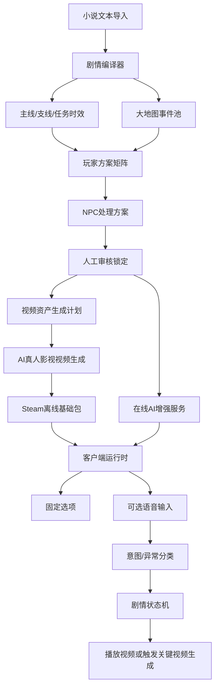

# AI 真人影视互动游戏对话归档

日期：2026-07-09  
目标平台：Steam  
状态：概念探索与第一版方向归档

## 1. 项目愿景

目标是开发一款发布到 Steam 平台的视频互动游戏。玩家通过界面点击、剧情选项和可选语音输入，与视频中的人物和场景互动。游戏剧情来自用户提供的大量小说文本，由 AI 分析世界观、角色、地点、事件、任务、时效和可能分支，再生成对应的剧情处理方案和 AI 真人影视视频资产。

核心风格是“真人影视感”的互动视频游戏，而不是视觉小说。主游玩画面尽量全部由动态视频承载，静态图只在菜单、档案、加载页或极少数辅助界面中使用。

## 2. 已确定的核心方向

第一版不是让 AI 在运行时生成所有内容，而是采用“先剧情编译，再视频生成，运行时少量动态生成”的路线：

1. 用户导入大量小说文本。
2. AI 分析世界观、人物关系、主线、支线、地点、事件和任务时效。
3. AI 在所有需要玩家选择或表达态度的位置，归纳玩家可能方案。
4. AI 为每种玩家方案生成 NPC 处理方案，包括回应、关系变化、任务推进、隐藏分支和后果。
5. 所有方案必须符合剧情总线，合理嵌入已有主线和支线。
6. 人工审核并锁定剧情、任务、分支和视频资产需求。
7. 剧情处理完成后，再生成对应的 AI 真人影视视频。
8. 游戏运行时播放预生成视频，并在少数关键剧情节点触发在线动态视频生成。

## 3. 视频生成策略

所有游戏视频都希望由 AI 生成，不使用真人拍摄或动作捕捉。

视频生成分为三类：

- 预生成主线和支线视频：剧情处理完成后批量生成，进入游戏包。
- 预生成 NPC 短视频回应库：每个互动场景根据玩家意图矩阵生成有台词、有口型的回应视频。
- 少量在线动态关键视频：根据玩家此前操作，在重大剧情转折处生成短视频，例如背叛、联盟、关键战斗、秘密揭露、星球级奇观。

不建议第一版每次玩家说一句话都实时生成新视频。普通互动应通过有口型的预生成短视频承接，只有高价值剧情节点才触发在线生成。

## 4. NPC 回应与口型策略

NPC 回应必须尽量口型对应。实现方式不是用任意循环视频承接自由台词，而是：

1. 玩家可以自由说话。
2. 系统将玩家语音归类到当前场景允许的剧情意图。
3. 每个意图预先对应一条或多条 NPC 回应台词。
4. 视频生成阶段按这些台词生成对应短视频。
5. 运行时只做语义匹配和变体选择。

示例：

玩家可能说：

- “你不说入口在哪，我不会相信你。”
- “别绕圈子，把遗迹入口告诉我。”
- “我知道你在隐瞒入口，说出来。”

系统可归类为：

```json
{
  "intent": "probe_ruins_entrance",
  "tone": "distrustful"
}
```

随后播放对应视频：

```text
S03_NPC_A_probe_ruins_entrance_distrustful_v01.mp4
```

## 5. 剧情节点交互

剧情节点默认提供固定选项，同时提供可选语音输入。

固定选项保证游戏在离线、低配或无麦克风场景下仍完整可玩。语音输入是高级入口，允许玩家用自己的话表达意图。

语音输入会被分类：

- 有效意图：进入对应剧情分支。
- 辱骂或挑衅：NPC 发怒、降低关系、离开、开战或触发其他剧情后果。
- 不相干内容：NPC 困惑、追问、无视或转移话题。
- 错误识别或低置信度：要求玩家重说，或走兜底回应。
- 输入太久：NPC 打断玩家、不耐烦、默认推进或触发时效后果。
- 沉默超时：NPC 离开、任务时间推进或默认分支。

具体处理方式由剧情文本、NPC 性格、当前任务和世界状态决定。

示例节点配置：

```json
{
  "node_id": "s03_npc_a_confrontation",
  "choices": ["probe_secret", "offer_trade", "threaten", "leave"],
  "voice_enabled": true,
  "voice_intents": ["probe_secret", "offer_trade", "threaten", "apologize", "accuse_identity"],
  "invalid_input_rules": {
    "insult": "npc_angry_warning_or_attack",
    "irrelevant": "npc_confused_prompt",
    "low_confidence": "ask_repeat",
    "too_long": "npc_interrupts",
    "silence_timeout": "npc_leaves"
  }
}
```

## 6. 高级语音设计

语音等级选择为高级，但语音功能本身是可选的。

在线版本中，语音可以影响：

- 剧情判断。
- 角色关系。
- 隐藏分支。
- NPC 即时态度。
- 任务完成方式。
- 支线和大地图事件触发。

语音处理推荐拆成两层：

- 即时语音对话层：玩家说话后，NPC 可以回应。
- 剧情裁决层：系统从语音中提取意图、语气、承诺、威胁、谎言、线索和隐藏触发条件，更新剧情状态。

AI 输出不应直接自由改写主线，而应进入结构化事件：

```json
{
  "intent": "accuse_hidden_identity",
  "tone": "confrontational",
  "target": "npc_a",
  "discovered_secret": "npc_a_false_identity",
  "relationship_delta": {
    "trust": -8,
    "fear": 12,
    "respect": 6
  },
  "hidden_branch_candidate": "expose_npc_origin",
  "confidence": 0.91
}
```

## 7. 主线、支线与任务时效

剧情采用主线和支线任务模式。

主线、支线、任务时效、成功后果、失败后果，都应根据用户提供的小说文本进行分析，并由人工审核后锁定。

任务时效采用混合模式：

- 剧情节点时效：例如“进入遗迹前没有完成支线就算错过”。
- 真实倒计时：例如追击、救援、爆炸、潜入等紧张任务。
- 世界状态推进：例如战争、灾变、阵营变化、NPC 命运变化。

失败不应只是 Game Over，而应继续成为剧情内容。

示例任务：

```json
{
  "quest_id": "rescue_envoy_01",
  "type": "side",
  "source_text_refs": ["chapter_03", "npc_a_backstory"],
  "states": ["locked", "available", "active", "completed", "expired", "failed"],
  "deadline": {
    "mode": "story_clock",
    "expires_before": "main_quest_enter_ruins"
  },
  "success_effects": ["npc_a_trust+15", "unlock_alliance_scene"],
  "expired_effects": ["npc_a_trust-8", "envoy_injured"],
  "failed_effects": ["envoy_dead", "faction_b_hostile+10"]
}
```

## 8. 场景结构

场景结构选择混合式：

- 关键主线和任务节点：使用受控节点式场景，玩家意图映射到有限的视频矩阵。
- 支线和角色关系场景：根据剧情需要使用节点式或半开放式。
- 大地图探索和低风险区域：允许更开放的行动和语音互动。

NPC 数量不在当前阶段固定，应根据实际剧情和资产预算决定。更重要的是每个场景允许多少玩家意图，以及每个意图需要多少视频变体。

## 9. 大地图自由行动

玩家在游玩剧情时可以自由行动，例如：

- 路过大地图的风景点去看看。
- 探索山间是否有机缘。
- 路见不平，锄强扶弱。
- 触发随机遭遇。
- 发现支线线索。
- 获得奇遇或资源。

建议采用“受控开放大地图”，而不是完全随机生成所有事件。

大地图事件来自文本解析出的地点、势力、人物、传说、冲突和事件池。AI 可负责匹配事件、生成变体、裁决后果，但不能破坏剧情总线。

开放事件可改变：

- 线索。
- 名声。
- 资源。
- 角色关系。
- 任务时间。
- 支线触发条件。
- 阵营态度。

开放事件不应随意改写核心主线真相。

## 10. 剧情编译器

需要一个剧情编译器，用于把小说文本转化成可执行游戏内容。

剧情编译器职责：

- 解析世界观、地点、角色、阵营、历史事件。
- 提取主线任务和支线任务候选。
- 标记需要玩家选择或表达态度的位置。
- 归纳玩家可能方案。
- 生成 NPC 处理方案。
- 判断每个方案如何嵌入剧情总线。
- 生成任务状态机。
- 生成场景意图矩阵。
- 生成视频资产清单。
- 标记哪些内容需要人工审核。

推荐第一版采用“AI 提取 + 人工审核锁定”，不要直接让 AI 完全自动生成最终剧情。

## 11. 在线与离线版本

游戏需要支持离线版本。默认离线版没有动态视频生成和开放式 NPC 云端对话功能。

离线版应支持：

- 播放预生成真人影视视频。
- 主线和支线固定分支。
- 本地任务状态机。
- 本地大地图事件池。
- 本地存档。
- 固定选项交互。
- 可选本地语音识别和意图匹配。

离线版不支持：

- 云端动态视频生成。
- 开放式 NPC 长对话。
- 云端大模型剧情推演。
- 云端生成新支线。

在线增强层支持：

- 高级语音理解。
- NPC 对话增强。
- 少量关键剧情视频动态生成。
- 云端剧情裁决。
- 内容生成、审核、转码和分发。

## 12. 离线语音识别

离线语音识别应是可选功能。

离线语音不等于离线自由聊天，而是：

```text
本地语音识别 -> 本地意图匹配 -> 播放已有视频分支
```

可选档位：

- 关键词或短语匹配：最轻量，但准确度有限。
- 本地语音转文字 + 场景意图匹配：推荐方向。
- 本地小模型语义理解：更强，但体积、性能和兼容性压力更大。

低配或不启用语音时，玩家仍可使用固定选项。

## 13. 服务端架构

如果使用 Google、OpenAI 等托管 AI 服务，项目自己的服务器第一版不需要 GPU。服务器主要负责：

- 客户端请求转发。
- 玩家鉴权。
- 任务队列。
- AI API 调用。
- 剧情状态校验。
- 视频生成任务管理。
- 视频审核。
- 视频转码压缩。
- 对象存储上传。
- CDN 下载地址签发。
- 成本控制和限流。

推荐 MVP 配置：

- API 服务器：2-4 vCPU / 4-8GB RAM。
- Worker 服务器：2-4 vCPU / 8-16GB RAM。
- 数据库：托管 PostgreSQL。
- 队列：Redis 或托管队列。
- 存储：GCS / S3 / R2 等对象存储。
- 分发：CDN + 短期签名 URL。
- 转码：优先 CPU + FFmpeg。

服务器不应把大视频文件直接转发给客户端。正确方式是将视频放入对象存储，客户端通过签名 URL 下载并本地缓存。

## 14. 动态视频生成流程

少量在线动态视频生成流程：


动态生成只用于关键节点，例如：

- 命运转折。
- 角色背叛。
- 联盟成立。
- 战斗爆发。
- 秘密揭露。
- 星球级奇观。

## 15. 程序更新与增量更新

游戏必须支持增量更新，不能每次更新都重新安装。

Steam 本身支持 SteamPipe 增量更新，但视频类游戏必须注意资源拆包策略，否则一个小改动可能导致大量下载。

建议拆分为：

```text
Base Client Depot
Chapter_01_Videos
Chapter_02_Videos
OpenWorld_Region_A_Videos
Language_CN_Audio_Subtitles
Optional_Offline_ASR_Model
Optional_HighRes_Video_Pack
```

原则：

- 基础程序和视频资源分离。
- 按章节、区域、语言、清晰度拆包。
- 不频繁修改大视频包。
- 新章节或大区域可用 DLC 或独立 depot。
- 离线 ASR 模型作为可选包。

## 16. Steam 与 AI 内容

游戏需要在 Steam 提交时说明 AI 内容使用方式。

应区分：

- 预生成 AI 内容：发售前生成并进入游戏包的视频、音频、字幕、场景。
- 运行时 AI 内容：玩家游玩过程中通过在线服务生成的关键视频、语音分析或 NPC 对话。

运行时 AI 内容需要说明防护措施，包括：

- 内容安全审核。
- 违规输入处理。
- 输出过滤。
- 成本限流。
- 未成年人或敏感内容保护。
- 玩家举报或日志追踪机制。

## 17. 第一版建议范围

建议第一版先做一个完整闭环，而不是直接做完整大世界：

- 一个主线章节。
- 少量支线任务。
- 一个可探索区域。
- 若干大地图随机事件池。
- 少量主要 NPC。
- 固定选项 + 可选语音输入。
- 有口型的预生成 NPC 短视频回应矩阵。
- 混合时效任务。
- 离线基础版。
- 在线增强层只开放少量动态关键视频生成。

## 18. 仍需后续确认的问题

后续正式设计和实施前，需要继续确认：

- 第一章剧情文本范围。
- 第一版采用的游戏引擎。
- 视频生成服务供应商。
- 语音识别供应商与离线 ASR 方案。
- 每个章节的视频资产预算。
- 大地图探索是 2D 地图、3D 区域、还是影视节点地图。
- 存档是否允许回溯分支。
- 在线生成视频的每日成本上限。
- 是否需要用户账号系统。
- 是否支持多语言。

## 19. 当前推荐架构总览



## 20. 归档说明

本文档整理了本轮对话中的产品方向、技术约束、运行时架构、内容生产管线、离线/在线版本、语音交互、增量更新和第一版范围。它不是最终实施计划，后续还需要在确认第一章剧情文本和技术栈后，拆成正式设计文档和实现计划。
