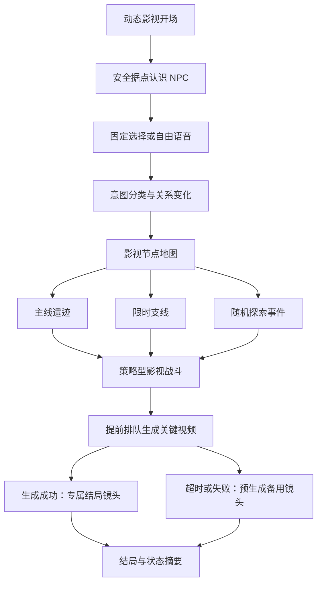

# AI 真人影视互动游戏垂直切片设计

日期：2026-07-12
状态：第一版开发基线
目标：用一个 20–30 分钟的完整章节验证核心体验和生产管线，而不是提前开发完整游戏。

## 1. 本切片要证明什么

第一验证目标：玩家使用固定选项或自由语音表达意图后，系统能正确理解，把输入映射到受控剧情意图，播放口型对应的 NPC 视频，并真实改变关系、任务和后续剧情。

第二验证目标：同一角色跨多个 AI 视频镜头时，脸、声音、服装、道具、伤势和表演风格足够一致，视频切换不破坏影视沉浸感。

第三验证目标：离线模式可以完整通关；在线 AI 只增强语音理解和一个关键视频节点，任何云服务失败都不会阻塞主线。

## 2. 推荐技术路线

### 2.1 客户端

- Unity 6，C#。
- Unity VideoPlayer 双播放器预加载，避免分支切换黑屏。
- Addressables 管理章节、区域、语言和视频资源包。
- 本地 JSON 剧情包和版本化存档。
- Windows 作为首个目标平台，Steam Deck 作为兼容性测试平台而不是首发硬要求。

选择 Unity 的主要原因不是它的 3D 能力，而是 C# 源码、测试和资源配置更适合由 AI 持续修改。未来如果项目转向真正自由镜头的 3D 大世界，再重新评估 Unreal。

### 2.2 服务端

- ASP.NET Core Web API，和 Unity 客户端共享 C# 数据契约。
- PostgreSQL 保存剧情版本、玩家状态、生成任务和审计记录。
- Google Cloud Tasks 或 Pub/Sub 负责任务排队。
- Cloud Run 承载 API；Cloud Run Jobs 或独立 Worker 执行 FFmpeg、审核和上传。
- Google Cloud Storage 保存生成结果，客户端通过短期签名 URL 下载。
- API 服务不直接转发大视频文件。

### 2.3 AI 服务

- OpenAI 文本模型：小说分析、结构化意图分类和剧情一致性检查。
- OpenAI GPT Image 2：角色定妆、服装状态、场景关键帧和视频首尾参考帧。
- Google Veo 3.1：预生成视频和一个运行时关键视频实验。
- OpenAI Transcribe：在线语音转文字基线。
- whisper.cpp：离线语音识别实验。
- 口型方案先对比 Veo 原生音频、Veo 画面加独立口型服务、预生成对白视频，最终只保留最稳定的一种。

所有外部服务必须经过内部 Provider 接口调用，客户端不得包含供应商 API Key 或具体模型名称。

## 3. 内容范围

### 3.1 建议章节结构

- 一名玩家角色，优先使用第一人称或少展示正脸。
- 两名主要 NPC，一名敌对角色或幻想生物。
- 三个地点：安全据点、山野探索区、遗迹或战斗区。
- 一条主线，一条可完成、错过或失败的支线。
- 三个大地图事件：风景探索、意外救援、隐藏机缘。
- 一场有策略选择的影视战斗，两种主要结局。

### 3.2 交互规模

- 10–14 个剧情交互节点。
- 每个普通节点 3–4 个固定选项。
- 其中 6–8 个节点允许语音输入。
- 每个语音节点定义 4–8 个有效意图和统一异常输入规则。
- 2 个隐藏意图分支。
- 1 个剧情时钟任务和 1 个短倒计时选择。
- 关系状态至少包含信任、畏惧、尊重三个维度。

### 3.3 视频规模

玩家单次体验为 20–30 分钟，不等于必须生成 30 分钟完全不重复的镜头。推荐目标：

- 12–18 分钟主路径独特成片。
- 8–15 分钟替代分支和 NPC 回应。
- 5–8 个无台词动态环境循环。
- 12–20 个 NPC 有口型短回应。
- 1 段 30–60 秒战斗，由多个 4–8 秒镜头剪辑组成。
- 1 个最多 8 秒的在线动态视频实验。

开发前半程只使用占位视频和 12–20 段真实 AI 视频。只有程序闭环、剧情图和台词锁定后，才批量生成剩余视频。

## 4. 玩家流程



## 5. 核心数据契约

- `StoryFact`：不能被支线或模型改写的世界事实。
- `CharacterDefinition`：身份、性格、声音和视觉规则。
- `CharacterState`：关系、伤势、服装、位置、已知秘密。
- `QuestDefinition`：状态、时限、完成、失败和过期后果。
- `SceneNode`：进入条件、视频、选项、语音能力和离开条件。
- `VoiceIntent`：允许意图、话题、语气、置信度阈值。
- `NpcResponse`：确定台词、情绪、口型视频和状态影响。
- `StateEffect`：对任务、关系、事实标记和时间的原子修改。
- `MediaAsset`：资源 ID、版本、哈希、语言、分辨率和依赖。
- `GenerationJob`：供应商、模型快照、提示词版本、种子、成本和结果。
- `SaveGame`：剧情包版本、当前节点、状态快照和迁移版本。

剧情编译器输出 `story.bundle.json`。客户端只运行已经通过校验和人工锁定的剧情包，不在本地让大模型自由改写主线。

## 6. 语音裁决规则

```text
录音 -> 语音活动检测 -> 转写 -> 内容安全检查 -> 场景限定意图分类
     -> 置信度与严重后果检查 -> 状态变化 -> NPC 视频回应
```

- 固定选项始终可用，语音不是通关必需项。
- 低置信度不能直接触发攻击、永久关系破裂或任务失败。
- 严重后果需要高置信度，或由 NPC 先追问确认。
- 辱骂、跑题、沉默、输入过长和无法识别都属于剧情输入类型。
- 在线或离线识别失败时都回退到固定选项。
- 默认不永久保存原始录音；开发测试录音必须取得明确同意并设置删除期限。

## 7. 视频连续性规则

每个角色都要有一份视觉圣经，包含正侧面和全身参考、不可变化特征、各剧情阶段服装与伤势、声音与表演方式，以及角色间身高比例。

每个镜头任务必须包含场景和镜头 ID、前后镜头、角色状态版本、首尾帧、景别、机位、台词、音频、禁止项、模型、种子、提示词版本和成本。

## 8. 验收指标

### 8.1 游戏体验

- 从启动到任一结局可以完整游玩，无阻断节点。
- 断网后仍可通过固定选项完成主线。
- 已预加载视频的分支切换不出现可见黑屏，95% 切换在 300 毫秒内开始播放。
- 存档加载后任务、关系、世界时间和媒体状态一致。

### 8.2 语音

- 使用至少 200 条中文测试语句建立固定评测集。
- 有效意图分类准确率达到 90% 以上。
- 将普通表达误判为辱骂、威胁等严重输入的比例低于 1%。
- 低置信度输入必定进入追问或固定选项回退。

### 8.3 影视和成本

- 主要角色在 80% 以上审核镜头中达到 4/5 的身份一致性评分。
- 所有带台词视频通过人工口型检查。
- 动态视频失败时备用结局仍可播放。
- 每个生成任务都有最大成本；在线生成有账号、章节和每日硬上限。
- 重复请求具有幂等键，不会因网络重试重复扣费。

## 9. 明确不做

- 真正自由镜头的 3D 开放世界、无限 NPC 自由聊天、运行时创建完整新主线。
- 多人联机、本地高质量视频生成、4K 游戏资源包、多语言口型版本。
- 完整商业支付系统。

## 10. 风险闸门

1. `G1 播放闸门`：双播放器预加载和分支切换达标。
2. `G2 角色闸门`：同一 NPC 的 10 段连续视频达到一致性指标。
3. `G3 语音闸门`：200 条语音测试集达到准确率和误伤指标。
4. `G4 云端闸门`：生成、审核、转码、存储、下载和备用视频完整跑通。
5. `G5 内容闸门`：剧情图无死路、所有节点有离线回退、台词正式锁定。

## 11. 当前官方约束

- Google Veo 3.1 典型片段长度为 4、6 或 8 秒，支持 16:9、720p/1080p 和 24 FPS：
  https://docs.cloud.google.com/gemini-enterprise-agent-platform/models/veo/3-1-generate
- GPT Image 2 是图像生成和编辑模型，不输出视频：
  https://developers.openai.com/api/docs/models/gpt-image-2
- Steam 要求分别披露预生成和运行时生成的 AI 内容：
  https://partner.steamgames.com/doc/gettingstarted/contentsurvey
- SteamPipe 会按块更新，但大型资源包和资源重排会放大补丁：
  https://partner.steamgames.com/doc/sdk/uploading
