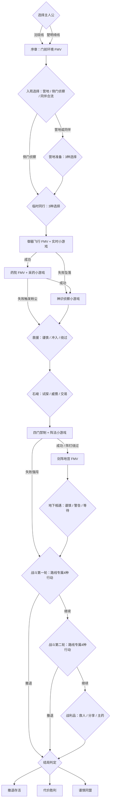

# 互动影视分支实现说明

## 当前结论

本垂直切片已经具备“本地影视片段 → 剧情文字与选择 → 状态变化 → 后续节点”的播放链路。四段现有视频都是高质量环境建立镜头，没有真人演员、角色对白或角色动作，因此当前版本只能用它们建立气氛，不能把它们描述成《盛世天下》式真人互动剧情。

所有视频只从 `Assets/StreamingAssets/Media` 读取。运行时不访问 Gemini、Veo、Vertex 或任何网络视频服务，视频也不能直接修改游戏状态；只有玩家选择和小游戏结果能够推进状态机。

## 已接入的四段环境 FMV

| 影视 ID | 本地文件 | 自动播放节点 | 内容与用途 |
| --- | --- | --- | --- |
| `fmv_gate_arrival` | `fmv_gate_arrival.mp4` | `prologue` | 湿石路、溪流、竹林、灯火与秘苑门；作为第一次抵达秘苑的建立镜头 |
| `fmv_celestial_flight` | `fmv_celestial_flight.mp4` | `flight` | 浮空岛、云海、瀑布和雷暴；作为御器飞行小游戏前导 |
| `fmv_herb_courtyard` | `fmv_herb_courtyard.mp4` | `herb_route` | 药院、水车、封井和发光灵植；作为采药调查前导 |
| `fmv_sword_vault` | `fmv_sword_vault.mp4` | `underground` | 地下剑阵、瀑布、锁链、火盆和灵光；作为破阵成功后的地宫入场镜头 |

四段均为 MP4、H.264 High Profile Level 3.1、1280×720、24 FPS、10 秒，并带 AAC-LC 48 kHz 双声道环境音。来源文件名、精确字节数和 SHA-256 记录在 `Assets/StreamingAssets/Media/README.md`。

## 当前播放流程与操作

1. 进入带有影视映射的剧情节点时，先保存 `pendingCinematicId`，再准备本地视频。
2. 准备期间保留黑底影视界面并显示“正在准备本地影视片段”。第一帧准备好后才显示视频，避免空 RenderTexture 闪屏。
3. 播放期间剧情选择不可操作；影视播放结束后才显示文字、人物信息和选项。
4. 玩家可以点击右上角“跳过 Esc”，或直接按 `Esc` 跳过。`Space` 不会跳过影视，避免与剧情文字快进键冲突。
5. 播放时普通场景音乐会被压低，视频使用存档中的 `cinematicVolume`。

现有四段没有演员和对白，因此当前没有叠加对白字幕。`subtitlesEnabled` 已进入存档模型，供后续真人对白片使用；字幕应由 Unity 文本轨渲染，不能烧录进视频。

## 缺失、错误与静态回退

`MediaDirector` 对每次请求只返回一次结果：`Completed`、`Skipped`、`Missing`、`Error`、`Timeout` 或 `Busy`。

- `Completed` / `Skipped`：把影视 ID 写入 `watchedCinematics`，清除待播标记，继续显示该节点的剧情与选择。
- `Missing` / `Error` / `Timeout`：隐藏损坏或未准备好的视频层，继续使用节点已有的场景图、3D舞台、文字和交互；不会卡死主线，也不会把失败片段记为已看。
- `Busy`：拒绝同时启动第二条视频，防止两个回调重复推进剧情。
- 构建前会检查四个规范文件都存在且每个至少 1 MiB；缺文件或异常小文件会中止构建并给出文件名。

## 存档、断点与重播规则

- 存档版本 2 保存 `watchedCinematics`、`pendingCinematicId`、`cinematicCheckpointSeconds`、影视音量和字幕偏好。
- 视频播放完成或被主动跳过后会立即存档；继续游戏时，已经看过的节点建立镜头不会自动重复播放。
- 如果程序在影视播放中途关闭，待播 ID 已经保存在当前节点。当前垂直切片会从该片段开头重新播放；`cinematicCheckpointSeconds` 已预留，但尚未实现逐秒续播。
- 解码失败不记为“已看”，下一次重新进入或继续该节点时可以再次尝试。
- 当前没有影视鉴赏馆或单片重播按钮。新游戏会得到空的 `watchedCinematics`，所以会重新播放全部建立镜头。正式版应在行旅志记中加入“已解锁影视”页面，并让手动重播不改变剧情状态、不重复发放奖励。

## 当前真实游戏分支图

下面是现在实际运行的状态图。选择不是装饰：它们会改变法力、护符、生命、信任、猜疑、暴露、救援状态、阵法状态和可用战斗选项，并且部分成功/失败会进入不同节点、看到不同的后续影视片段。四段现有 FMV 仍然只是环境镜头；真正的演员表演后果片尚待补充。



“真人互动影视”需要在选择之后播放不同的表演片，而不是让三个按钮都回到同一条视频。例如救援节点应当形成三条明确的影视边：

```text
rescue_prompt
  ├─ rescue_careful → actor_rescue_careful → shijun_entry_prepared
  ├─ rescue_rush    → actor_rescue_rush    → shijun_entry_wounded
  └─ rescue_skip    → actor_rescue_skip    → shijun_entry_distrust
```

每条边至少需要记录：当前影视 ID、选择 action ID、条件、下一影视 ID、下一剧情节点、状态增减、首尾帧连续性和是否允许汇流。`choiceHistory` 已在存档中预留，正式接线时应记录 action ID，而不是按钮显示文字。

## 最低真人演员片段清单

要让当前 20–30 分钟垂直切片的关键节点出现可信真人分支，而不是只有四段环境视频，诚实最低需要增加 **45 段演员片**。旧版31段估算漏掉了山门两条主线共6段选择后果、6段必要情境片中的路线倍数，以及2段战斗情境片，不能再作为交付数量。

| 片段组 | 数量 | 最低内容 |
| --- | ---: | --- |
| 双主角路线开场情境 | 2 | 沈砚、楚明绮各一段抵达与人物建立镜头 |
| 山门三选后果 | 6 | 两条主线分别对应营地、侧门侦察、同伴合流 |
| 同行情境＋选择后果 | 8 | 两条主线各1段情境片，并各有谨慎合作、公开合作、拒绝合作3段后果 |
| 救援情境＋选择后果 | 8 | 两条主线各1段情境片，并各有布置掩护、冒险冲入、放弃救援3段后果 |
| 石峻情境＋交锋后果 | 8 | 两条主线各1段情境片，并各有试探、威慑、交易3段后果；保持石峻身份和站位连续 |
| 地下双主角会面 | 4 | 1段共同情境片，加谨慎、警告、等待3种回应 |
| 战斗情境＋关键后果 | 6 | 男女路线各1段情境片，加控场/保护、暴露底牌、联手反击、撤退4种关键后果 |
| 三种结局 | 3 | 撤退存活、代价胜利、谨慎同盟 |
| **合计** | **45** | 与现有4段环境片组成关键节点最低49段影视库；其中山门、药苑环境片仍应重做 |

这45段能让一次流程在关键节点看到约10–14段演员表演，并让这些选择真正改变下一段画面，但营地、部分调查、小游戏和战后分配仍由Unity承担。覆盖当前实际14节点剧情树的最低完整包是108段演员片＋9段共享动态环境片＝117段；加入独立小游戏结果、状态变体和汇流镜头的推荐制作版是140段演员片＋9段环境片＝149段。

## 后续片段交付要求

- 同一角色锁定演员脸型、年龄、发型、服装层次、佩饰和兵器，不得在分支间漂移。
- 每条选择片保留约 12–24 帧可剪接的入点和出点；记录人物出画方向、眼线、手持物和伤势状态。
- 相邻片段锁定场景轴线、时间、天气、灯位、镜头焦段和色彩管理；生成或拍摄前先批准 continuity sheet。
- 建议最终交付 1920×1080、24 FPS、H.264 High Profile、AAC 48 kHz；运行版可另做码率优化副本。
- 对白、分支提示和字幕不要烧录进画面；对白音轨与字幕时间码应单独交付。
- 每段视频必须有稳定的规范 ID，不能再用自然语言文件名作为运行时键。
- 任何 Gemini/Veo 生成均须用户再次明确授权；否则只输出提示词和镜头表，不调用视频 API。
